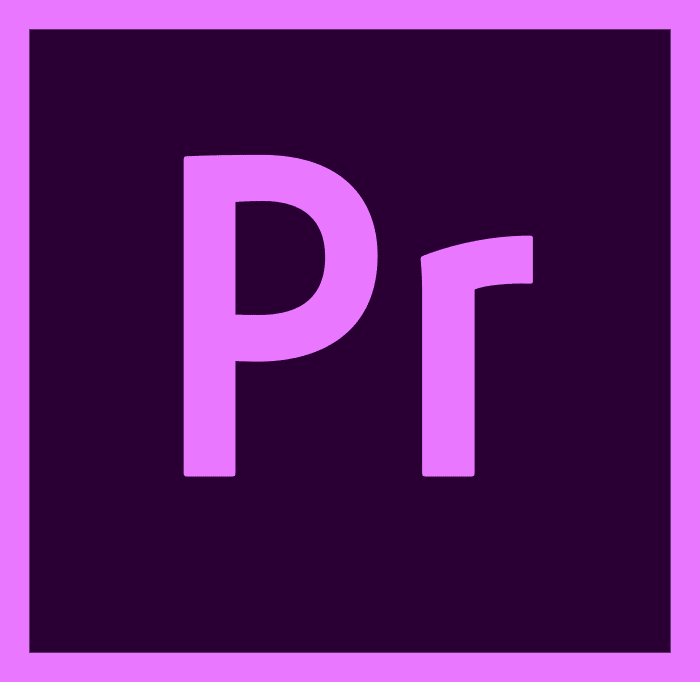
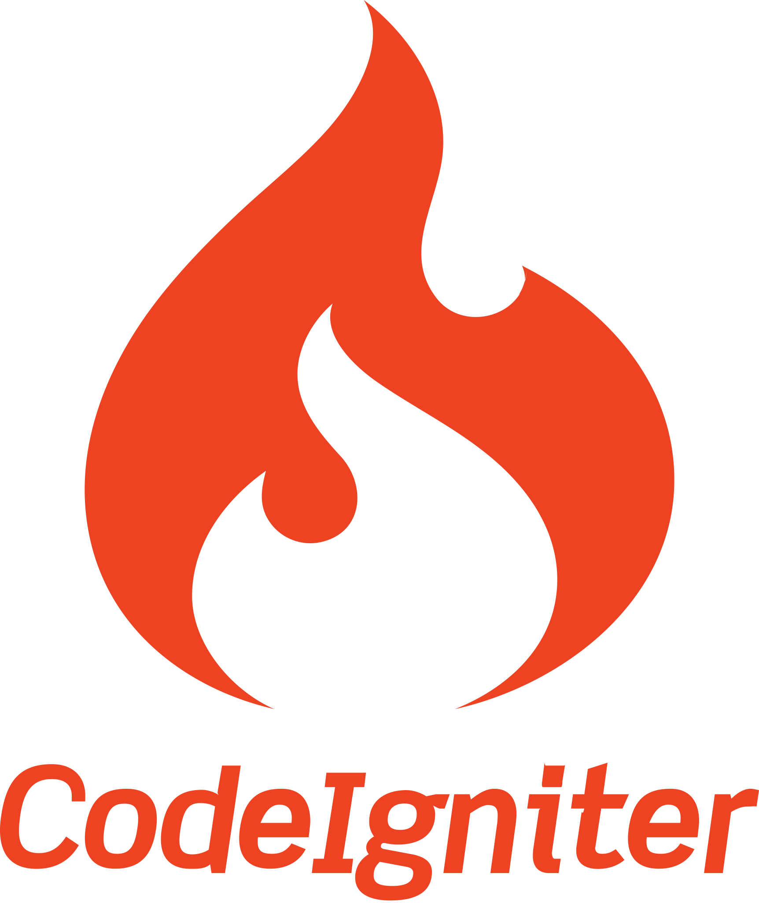

## Hey 👋, I'm Mogsaw  
  

  
  

### Glad to see you here!  
I’m a full-stack developer who has turned years of freelancing into a full-time career. Being a full-stack allows me to not only develop client-facing apps and websites but also develop it with cutting edge backend support.

I specialize in building robust backends that do all the heavy lifting for your app or website. I love designing systems that are light yet powerful, distributed yet synchronized and beautiful yet effective. I also frequently blog about the world behind the screen which involves system designs, databases, security, servers, optimisation and also promising technologies like Blockchain and PWAs.  
  

   

## Rapidfire  
- 💻 I’m currently working at [Powertools Company](https://mesinhl.com/)  
  

- 📖 I’m currently learning Hyperledger and Kubernetes  
  

- ❓ Ask me about anything related to MERN stack and related technologies  
  

- ⚡ Fun fact: I keep night shift swithed on at all times   
  

   

## Languages and Tools  

  
  
  
  
  
  
  
  
  
  
  
  
  
  
  
  
  
  
  
  
  
  
  
  
  
  
  
  
  
  
  
  
  
  
  
  
  
  
  
  
  
  
  
  
  
  
  
  
  
  
  

  

   

## Github Stats  
<table><tr><td valign="top" width="50%">

</td><td valign="top" width="50%">

</td></tr></table>  

   

  

 

----

Made with Heart <a href="https://mgswid.github.io/" target="_blank">MGSWID &copy; 2022</a>
